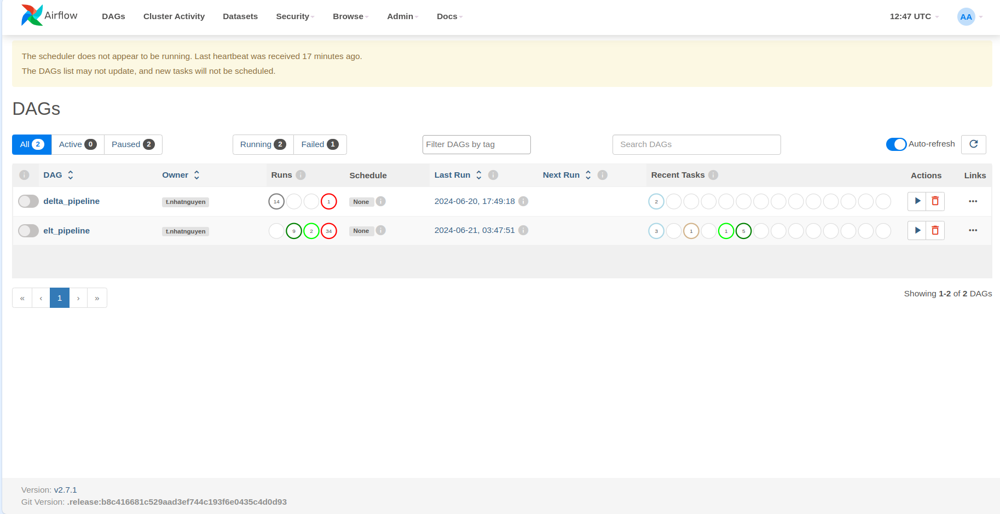
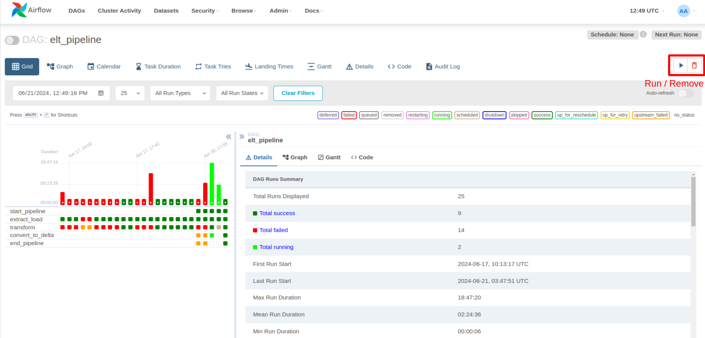
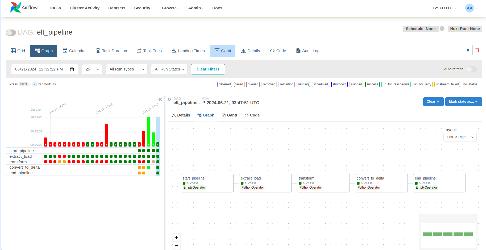

# Airflow - Data Orchestration

<p align="center">


## Getting Started

1.  **Create airflow project**:

```bash
    docker compose -f airflow-docker-compose.yaml up -d --build
```

After that, you can see the following structure:

```shell
.
├── airflow/                                     /* airflow folder including dags,.. /*
│   ├── config/                                     /* contain config files for airflow /*
│   ├── dags/                                       /* contain all dags in pipeline /*
│       ├── elt_pipeline_dag.py                         /* dag: extract - load - process (ELT pipeline) and convert to delta lake format /*
│       └── delta_dag.py                                /* dag: convert parquet to delta lake format /*
│   ├── data/
│   ├── include/
│   ├── plugins/
│   ├── Dockerfile                                  /* build image to run airflow container /*
│   ├── README.md
│   └── requirements.txt                            /* dependencies for airflow /*
```

2. **Access Airflow webserver**:

You can access at `http://localhost:8080/` and login with username && password is `airflow`

<p align="center">


3. **Run DAG**:

You can manually run DAGS by click on `Run`

<p align="center">


## Result:

<p align="center">


<p align="center">
    Airflow Result
</p>

---

<p>&copy; 2024 NhatNguyen</p>
